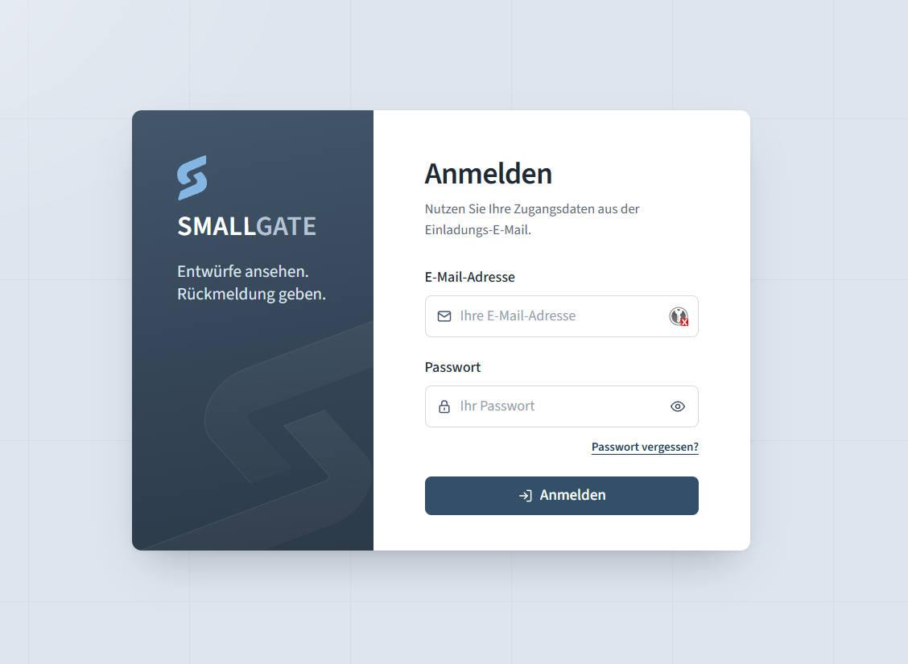
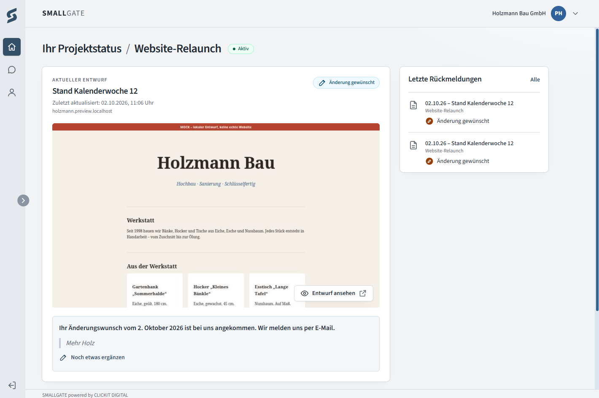
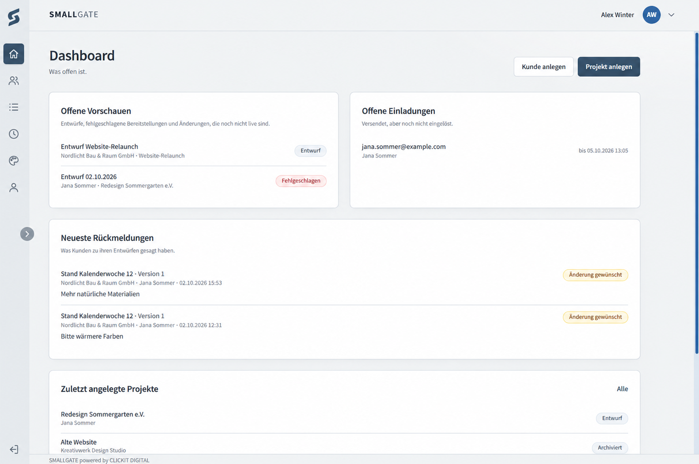

# Smallgate

A very small, self-hosted client portal. Your clients sign in, look at the
current draft of their website and tell you whether it fits. Nothing else.

Built for web agencies, freelancers and in-house teams who keep clients in the
loop by email and just need one honest place to answer *"can I see it?"* —
without handing a third-party SaaS the client list. It is free software under
the MIT licence: use it, change it, run it for your own clients.

**Deliberately not included:** no CRM, no invoicing, no document archive, no
chat, no notification centre. Invoices, documents and discussions stay in email,
where they already work.

- [A short tour](#a-short-tour)
- [Stack](#stack) · [Requirements](#requirements) · [Setup](#setup)
- [Security](#security) · [Previews](#previews) · [Tests](#tests)
- [Configuration](#configuration) · [Running in production](#running-in-production)
- [Project structure](#project-structure) · [Contributing](#contributing) · [Licence](#licence)

## A short tour

The interface is German; the screenshots show the demo data from the seeder.

### Sign-in



There is no public sign-up. Accounts exist only because an administrator
invited somebody; the invitation mail leads to a page where the new user sets
a password. Wrong password, unknown address, blocked account — the sign-in
answers all of them with the same message.

### For your clients



A customer lands on a single page per project: its status, the current draft
as a card with a screenshot, an **Entwurf ansehen** button and two answers —
**Passt so** or **Änderung wünschen**, with an optional note. Beside it are the
last answers. The speech bubble in the navigation opens **Nachrichten**, the
archive of every answer given. It is not a chat: replies still come by email
(to `CONTACT_EMAIL`).

Customers see only their own projects, change their own password and answer
drafts. They have no other write access.

### For administrators



The dashboard shows what is open: drafts and failed provisionings, invitations
not yet redeemed, the latest answers from customers and the newest projects.
From there an administrator

- creates customers and projects, and invites the people who may see them,
- adds previews, releases them with **Bereitstellen** and re-creates their
  screenshot,
- creates the project's folder on the server with **Ordner anlegen**,
- blocks accounts, resends or revokes invitations,
- sets name, colours, logos and legal links under **Erscheinungsbild**,
- and reads under **Protokoll** who did what.

## Stack

| Part | Choice |
|---|---|
| Framework | Laravel 13 |
| PHP | 8.4 (in the container) |
| Database | PostgreSQL 17 |
| Frontend | Blade + Tailwind CSS 4, ~20 lines of own JavaScript |
| Tests | Pest 5 / PHPUnit 13 against real PostgreSQL |
| Development | Docker Compose, Mailpit for mail |
| Background jobs | Laravel queue on the database, `worker` service |
| Thumbnails | `playwright-core` + Chromium, run by the worker only |

A Laravel monolith. No REST API, no SPA framework, no Redis, no microservices,
no external services, no CDNs.

## Requirements

Docker with Compose. PHP, Composer and Node are **not** needed on the host —
everything runs in the container.

For production you additionally need a domain, a TLS-terminating reverse proxy
and an SMTP server that can send invitation and password-reset mail.

## Setup

```bash
git clone https://github.com/r0b0tan/Smallgate.git
cd Smallgate

cp .env.example .env

# Build the image with the host uid/gid so file permissions line up
docker compose build --build-arg UID=$(id -u) --build-arg GID=$(id -g) app

./sg composer install
./sg artisan key:generate
./sg up

./sg artisan migrate
./sg artisan db:seed          # demo data, refuses to run in production

./sg npm install
./sg npm run build
```

The `worker` service (part of `./sg up`) runs queued jobs: the preview
thumbnails and the password reset mails. Without it, previews still work and
the cards show a placeholder until a worker picks the job up, but no reset
mail goes out.

Then:

| Service | Address |
|---|---|
| Portal | http://localhost:8080 |
| Mailpit (outgoing mail) | http://localhost:8025 |
| PostgreSQL | localhost:55432 |

For frontend work with hot reload:

```bash
docker compose --profile dev up vite
```

### Demo accounts

The seeder creates a handful of fictional customers so the portal is not empty
on first run. All demo accounts share one password, taken from `SEED_PASSWORD`:

```
passwort-nur-fuer-lokale-entwicklung
```

| Email | Name | Role | Good for |
|---|---|---|---|
| `admin@example.test` ¹ | Admin ¹ | Administrator | Everything under `/admin` |
| `marion@holzmann.test` | Marion Holzmann | Customer — Holzmann Bau GmbH | Two projects, an available preview and a draft |
| `peter@holzmann.test` | Peter Holzmann | Customer — Holzmann Bau GmbH | Second user of the same customer, sees the same projects |
| `sabine@bergblick.test` | Sabine Wirth | Customer — Hotel Bergblick | Second customer, sees none of Holzmann's projects |
| `joerg@altmann.test` | Jörg Altmann | User of a **deactivated** customer | Sign-in is refused |

¹ From `SEED_ADMIN_EMAIL` and `SEED_ADMIN_NAME`; shown are the defaults from
`.env.example`.

The `.test` addresses exist nowhere. Invitations and password resets sent to
them land in Mailpit (http://localhost:8025).

The seeder refuses to run when `APP_ENV=production`. Adapt
`database/seeders/DatabaseSeeder.php` to your own examples, or skip the seed
step and create the first administrator yourself:

```bash
./sg artisan admin:create
```

It asks for name, address and password; the password only through a hidden
prompt, never as an argument, so it ends up neither in the shell history nor in
the process list. The command therefore runs interactively only. It creates
administrators and nothing else.

Every further account is created through the invitation flow in the portal.

### Language

The user interface and validation messages are **German**. Code,
comments and tests are English. Translating the UI means going through
`resources/views` and `lang/` — there is no locale switcher, and the strings are
not yet extracted into translation files.

## The `./sg` helper

A thin wrapper around `docker compose` so everything runs with the host's
uid/gid:

```bash
./sg up                  # start the stack
./sg down                # stop the stack
./sg artisan <command>   # artisan
./sg composer <command>  # composer
./sg test                # the full test suite
./sg pint                # format code
./sg npm <command>       # npm
./sg shell               # shell in the app container
./sg logs                # follow logs
```

## Security

The decisions, so you can judge them rather than trust them:

**Passwords** — Argon2id (OWASP parameters: 64 MiB, 4 iterations), exclusively
through Laravel's `Hash` facade. No home-grown cryptography, no encryption of
passwords.

**Sign-in** — rate limiting per email+IP combination (five failed attempts per
minute), so attacks on one account do not lock another out, plus a limit per IP
across all accounts (twenty per minute) against password spraying. A
successful login clears only the first counter. Distributed guessing across
many source addresses is not prevented. The session id is regenerated after
login, and there is a single generic error message for wrong password, unknown
address, blocked account and deactivated customer. "Forgot password" answers
identically whether or not the address exists — in wording and in time: failed
sign-ins and reset requests take at least `AUTH_TIMEBOX_DURATION` (0.5 s), and
the reset mail is sent by the queue worker instead of inside the request.
Changing one's email address asks for the current password and notifies the
previous address.

**Host header and generated links** — password-reset and invitation mails
contain absolute URLs. So a forged `Host` header cannot send a valid token to a
foreign domain, two layers apply: requests with an unconfigured `Host` are
rejected (`TRUSTED_HOSTS`, outside `local`; subdomains are *not* trusted), and
every generated URL is pinned to `APP_URL` — including in queue workers and
console commands, where there is no request at all. `X-Forwarded-*` is honoured
only from the proxies listed in `TRUSTED_PROXIES`; with none listed the headers
are ignored.

The web server in front should reject unknown hosts itself as well (in nginx, a
`default_server` with `return 444`). The production configuration
(`docker/nginx/prod.conf.template`) does; the development one deliberately does
not.

**Sessions** — database driver, `HttpOnly`, `SameSite=lax`, `Secure` in
production. After a password change or reset, all other sessions are deleted and
remember-me tokens discarded. A blocked user or a deactivated customer loses
access on the **next request**, not at the next login.

**Authorisation** — policies without a blanket `Gate::before`; every ability is
spelled out separately, and the default is deny. Customer data is narrowed
through the `Project::visibleTo()` scope, so a foreign or unknown id yields
**404**, never 403, and is indistinguishable from the outside.

**Mass assignment** — `role`, `customer_id`, `is_active`, `project_id`,
`provisioned_at` and a preview's `status` are `$fillable` nowhere. The
invitation model is fully `#[Guarded]`. PostgreSQL CHECK constraints additionally
enforce that a customer user always has a customer and an administrator never
does.

**Invitations** — 256-bit CSPRNG tokens, stored only as a SHA-256 hash. Time
limited, single use; resending invalidates the previous link immediately.
Redemption runs in a transaction with `lockForUpdate`, so two simultaneous
redemptions cannot both create an account.

**Ids** — ULIDs as primary keys for every publicly visible resource. Sequential
integers would be countable and enumerable.

**Privacy** — technically necessary cookies only. No tracking, no analytics, no
external JavaScript, no CDNs. Fonts are bundled locally from npm packages. The
portal is excluded from search engines with `noindex`. No tokens, secrets or
personal data are written to the application log.

**Activity log** — the administration's **Protokoll** records sign-ins (failed
ones too), password and profile changes, invitations, blocking, changes to
customers, projects and previews, and the customers' answers. An entry only
points at the user and the record concerned. It never copies a name, an email
address, a comment or an IP address; a failed sign-in on an address without an
account is not recorded at all. Entries are deleted after
`ACTIVITY_RETENTION_DAYS` (default 90) with the next recorded action, so no
scheduler is needed. New actions are cases of `App\Enums\ActivityAction` plus a migration
that widens the `activities_action_check` constraint.

**Erscheinungsbild** — under **Erscheinungsbild** the administrator sets the
name next to the logo (also in the browser tab and the mails), the footer text
(also in the mails), a main and an accent colour, and a logo each for light and
dark backgrounds. Every empty field falls back to the built-in look
(`APP_NAME`, "SMALLGATE powered by CLICKIT DIGITAL", the "S" mark, the navy
theme). The colours reach the page as
`/erscheinungsbild.css`, loaded after `app.css` — the CSP forbids inline
styles — and the shades are mixed by the browser with `color-mix()`. Logos
are PNG or WebP only (an SVG from the portal's own origin could carry script),
stored on the private disk and served by `BrandingAssetController` under a
versioned URL with `nosniff` and a sandboxing CSP. Both routes run without a
session. Without a dark logo, the light one sits on a white tile on the
sign-in panel. The logos also replace the favicon — with both set, the light
one for a light browser tab and the dark one for a dark tab.
**Impressum** and **Datenschutz** are hidden until set. Each can link the
operator's own page by `https://` URL (`/impressum` and `/datenschutz` then
redirect there) or show a pasted text at those routes. The text is Markdown,
every line break kept, with all HTML stripped and unsafe links dropped
(`Branding::legalHtml()`), so nothing pasted can run in the portal.

**Preview targets** — paths and upstream URLs come exclusively from an allowlist
in `config/previews.php`. Path traversal is resolved lexically; existing paths
are additionally checked against symlinks with `realpath()`. Upstream URLs must
be HTTPS and use an allow-listed host with no IP literal, no credentials and no
unexpected port. Customers can never influence a target. They never see a
directory path; an upstream URL is the address they are sent to, and it is
checked against the allowlist again on every redirect.

These checks are input validation, not complete SSRF defence: hostnames are not
resolved, private or loopback addresses behind an allowed name are not detected,
and redirects and DNS rebinding are not handled. Likewise `realpath()` does not
protect against symlinks created after the check (TOCTOU), nor against targets
that do not exist yet. As long as only `NullPreviewProvisioner` exists, no
connection is opened and no file is served — before real serving lands, both
checks must be repeated and completed at the actual I/O point.

**Project directories** — **Ordner anlegen** on the project page creates
`<customer-slug>/<project-slug>` below `PROJECT_DIRECTORY_ROOT` (default
`storage/app/previews`), and that is the one exception to "Smallgate changes no
server files". The name comes only from the two slugs, which the database
restricts to `[a-z0-9-]`. It is fixed on the first click and never follows a
rename. The queue worker creates it level by level, refuses symlinks, checks
the result with `realpath()` and only ever creates: no deleting, renaming,
`chmod`, `sudo` or shell command. The root itself must already exist and be
writable by the worker. The reasoning, and how to point it at a deployment
directory outside the volume, is in
[docs/adr/0002-project-directories.md](docs/adr/0002-project-directories.md).

## Previews

In the MVP a preview is **only a protected entry in the portal**. There is no
subdomain serving and no proxy yet.

What is already prepared:

- A single wildcard DNS record (`*.preview.example.com`, configured through
  `PREVIEW_BASE_DOMAIN`) is enough — Smallgate never creates DNS records.
- `previews.hostname` is globally unique, so a `Host` header can later be mapped
  to exactly one preview.
- The `App\Contracts\PreviewProvisioner` interface marks the system boundary.
- The only implementation, `NullPreviewProvisioner`, changes **no** server files
  and runs **no** privileged commands.

The architecture decision for real serving is deliberately still open —
including the security problems of session cookies across several subdomains:
[docs/adr/0001-preview-subdomain-architecture.md](docs/adr/0001-preview-subdomain-architecture.md).

An administrator creates a preview as a draft and releases it with
**Bereitstellen**; the status is the result of that action, never a form field.

### Two kinds of address

- **Static directory** — opened at its own subdomain below
  `PREVIEW_BASE_DOMAIN`, which it needs before it can be released.
- **Upstream URL** — opened at that URL, path included, e.g.
  `https://customer.example.com/joinery-holzmann`. No subdomain needed; the
  host must be listed in `PREVIEW_ALLOWED_UPSTREAM_HOSTS`.

Either way the customer clicks through the portal route, which checks access
and status first and only then redirects. Smallgate protects the way *to* the
preview, not the preview itself: whoever knows an upstream URL can open it,
unless the server it lives on asks for credentials of its own. Treat such
paths as unlisted, not as secret.

### Versions and feedback

Every successful **Bereitstellen** publishes a new *version* of the preview.
The customer is asked for feedback per version: after a re-provisioning the
card shows "Ihre Rückmeldung fehlt" again. Feedback is stored in
`preview_feedback` with the version it refers to; the form's version is only
compared, never trusted — if a newer version went live meanwhile, the answer
is refused with a hint to look again. Customers can only answer previews they
are offered (anything else is a 404); administrators read feedback but cannot
give it.

### Thumbnails

Previews are websites (a static directory or an allow-listed upstream URL);
there are no PDF or image previews in Smallgate. Each published version gets
one screenshot:

- **When:** queued on provisioning, or by **Vorschaubild neu erstellen** on the
  project page, or for all missing ones with `./sg artisan previews:thumbnails`
  (`--all` redoes existing ones). Never on a page view.
- **How:** `App\Jobs\GeneratePreviewThumbnail` → `PreviewScreenshotter` →
  `scripts/preview-screenshot.mjs`. Viewport 1440 × 900, stored as a 720 × 450
  JPEG. "Ready" means: load event, network quiet (bounded), `document.fonts`
  loaded, images in the first screen decoded, two painted frames. A preview
  that renders on the client can opt into an explicit signal: put
  `data-smallgate-wait` on `<html>` and set `data-smallgate-ready` when done.
  Overall timeout: `PREVIEW_THUMBNAIL_TIMEOUT`.
- **Versioning:** the picture is stored with the version it shows. A job for a
  superseded version does nothing; a result that arrives after a newer version
  went live is discarded. A picture of an older version counts as stale: the
  customer never sees it (placeholder instead), the administrator sees it
  marked "Veraltet".
- **Failure:** the card shows a placeholder ("Website-Entwurf" + name), the
  preview stays reachable. The log gets the preview id, the version and a
  reason code (`timeout`, `target_missing`, `address_not_public`, …) — never a
  target, URL or token.
- **Access:** files live on the private `local` disk and are served only
  through the portal route (same scope and policy as the preview, current
  version, available status only) and the admin route.

What the browser may open — the target is re-checked with
`PreviewTargetGuard` right before the browser starts, then:

- *Static directory:* served to Chromium from disk under a fixed, unresolvable
  origin by the script's request handler, with its own traversal and symlink
  checks. Nothing touches the network.
- *Upstream URL:* the host is resolved in PHP, every address must be globally
  routable (`FILTER_FLAG_GLOBAL_RANGE`), and Chromium is pinned to the checked
  address with `--host-resolver-rules`, so DNS rebinding cannot redirect it.
  Only HTTPS requests to that host pass; assets from CDNs are blocked, so such
  a thumbnail may lack external fonts or images.
- In both modes every other request is aborted, and — because redirects and
  IP literals bypass the request handler — Chromium additionally runs behind a
  proxy that does not exist (loopback included) with a resolver that knows no
  other name. Each layer alone was verified to stop a redirect to a loopback
  server.

Chromium's own process sandbox is on as well (`PREVIEW_THUMBNAIL_SANDBOX`),
so a page that exploits the renderer is still confined to namespaces and a
seccomp filter instead of reaching the container, which holds the whole
project including `.env`. Docker's default seccomp profile refuses the
namespaces the sandbox needs, so the `worker` service runs with
`docker/seccomp/chromium.json`: Docker's default profile plus `clone`,
`setns` and `unshare`, nothing else. After launch the script checks
`chrome://sandbox`; without a working sandbox it refuses with
`sandbox_unavailable` instead of rendering unprotected. The `app` container has
no such profile — previews are never rendered there. (Alpine's Chromium 152
additionally needs `--disable-gpu-shader-disk-cache` under the sandbox; see the
comment in the script.)

External hosts stay blocked on purpose: an upstream preview is expected to
live entirely on its own host, e.g. `https://customer.example.com/joinery`.

**Installation:** the app image installs Alpine's `chromium`, `nodejs` and
`font-noto` (Playwright's own browser builds do not run on Alpine);
`playwright-core` comes with `./sg npm install`. Outside Docker, install Node,
run `npm install` and either point `PREVIEW_THUMBNAIL_CHROMIUM` at a Chromium
binary or leave it empty and run `npx playwright install chromium`.

## Tests

```bash
./sg npm run build   # needed once: the views embed the Vite manifest
./sg test
```

Tests run against a real PostgreSQL database (`smallgate_test`, created
automatically by the `db` container on first start) and **not** against SQLite —
the schema's CHECK constraints and regex operators are explicitly part of what
is being tested.

Covered among other things: no public registration, creating customers, the
invitation flow including single use and expiry, tenant isolation, 404 instead
of 403 for foreign ids, blocked users and deactivated customers, login rate
limiting, session revocation on password change, mass-assignment protection, and
path-traversal and SSRF defence for preview targets.

## Configuration

Every sensitive value comes from an environment variable. `.env.example`
contains no real secrets and is commented throughout.

Set these before running in production:

```dotenv
APP_ENV=production
APP_DEBUG=false
APP_KEY=<php artisan key:generate>
APP_URL=https://portal.example.com
SESSION_SECURE_COOKIE=true
LOG_LEVEL=info

# Only needed if the portal is reachable under further names.
TRUSTED_HOSTS=
# Addresses or CIDR ranges of the reverse proxy that terminates TLS.
TRUSTED_PROXIES=
```

`APP_URL` is not cosmetic: it is the canonical base for every generated link and
at the same time the first trusted host. Without `TRUSTED_PROXIES`, an
application behind a TLS-terminating proxy sees `http` instead of `https`.

`SESSION_DOMAIN` stays empty. The session cookie must never be set on the parent
domain — the reasoning is in ADR 0001.

Imprint and privacy policy are set under **Erscheinungsbild**: a link to the
operator's own pages or a pasted text. Smallgate ships no legal wording of its
own. Whatever is used needs legal review before you go live, and the privacy
policy has to cover the portal (accounts, session cookies, invitation mails,
answers, the activity log).

## Running in production

`compose.prod.yaml` is the production stack. It is used on its own, never
together with `compose.yaml`:

| | Development (`compose.yaml`) | Production (`compose.prod.yaml`) |
|---|---|---|
| Code | bind-mounted from the working copy | baked into the image, no dev dependencies |
| Assets | `npm run build` / Vite on the host | built in the image |
| Database | published on `localhost:55432` | internal network only |
| Mail | Mailpit | your SMTP server |
| Ports | `127.0.0.1` unless `DEV_BIND` says otherwise | web port on `127.0.0.1` only (`WEB_BIND`) |
| nginx | answers every host | answers `PORTAL_HOST` only, HSTS |
| Migrations | by hand | the one-shot `migrate` service, before app and worker start |

PHP runs as `www-data` against read-only code; only `storage/` (a volume) and
`bootstrap/cache/` are writable. The `worker` keeps Chromium's sandbox with the
same seccomp profile as in development.

### First deployment

TLS is terminated by a reverse proxy on the same machine. It must pass the
original `Host` header and set `X-Forwarded-For`, `-Proto`, `-Host` and
`-Port` itself rather than pass on what the client sent. With Caddy:

```
portal.example.com {
    reverse_proxy 127.0.0.1:8080 {
        header_up X-Forwarded-Port 443
    }
}
```

The security side of running Smallgate — server, proxy, `.env`, accounts,
backups, updates and a go-live checklist — is covered in German in
[docs/sicherer-betrieb.md](docs/sicherer-betrieb.md).

Then:

```bash
git clone https://github.com/r0b0tan/Smallgate.git && cd Smallgate
cp .env.example .env
echo "base64:$(openssl rand -base64 32)"   # the value for APP_KEY
```

Fill in `.env` before running any `docker compose -f compose.prod.yaml`
command — the file refuses to load without `PORTAL_HOST` and `DB_PASSWORD`:

```dotenv
APP_KEY=base64:...
APP_URL=https://portal.example.com
PORTAL_HOST=portal.example.com       # the host of APP_URL
TRUSTED_PROXIES=172.30.80.0/24       # = DOCKER_SUBNET, see below
LOG_STACK=stderr                     # logs go to `docker compose logs`
LOG_LEVEL=info
DB_PASSWORD=<long random value>      # the stack refuses to start without one
MAIL_HOST=... MAIL_PORT=... MAIL_USERNAME=... MAIL_PASSWORD=... MAIL_FROM_ADDRESS=...
CONTACT_EMAIL=...
```

`APP_ENV=production`, `APP_DEBUG=false` and `SESSION_SECURE_COOKIE=true` are
set by `compose.prod.yaml` itself and cannot be overridden from `.env`.

`TRUSTED_PROXIES` names the internal network, not the reverse proxy's own
address: requests reach PHP from the nginx container, and the proxy on the host
arrives through that network's gateway. If `172.30.80.0/24` is taken on your
machine, set `DOCKER_SUBNET` to a free range and use the same value in
`TRUSTED_PROXIES`. This is safe because the web port listens on loopback only
(`WEB_BIND`) — nothing but the local proxy can reach it.

Start the stack and create the first administrator:

```bash
docker compose -f compose.prod.yaml up -d --build
docker compose -f compose.prod.yaml exec app php artisan admin:create
```

### Updates

```bash
git pull
docker compose -f compose.prod.yaml up -d --build
```

`migrate` runs first; `app` and `worker` start only once it has succeeded.
Configuration is cached on every container start, so a change to `.env` needs
`docker compose -f compose.prod.yaml up -d --force-recreate`.

### Backup and restore

All state lives in two volumes: `db-data` (PostgreSQL) and `storage`
(thumbnails, static preview directories under `storage/app/previews`, logs if
not sent to stderr).

```bash
scripts/backup.sh                 # into ./backups
scripts/backup.sh /srv/backups    # or anywhere else
```

Each run writes a database dump (`pg_dump` custom format) and an archive of
`storage/app`, both readable by their owner only — they contain personal data.
The stack keeps running meanwhile. Run it from cron, copy the files off the
machine and delete old ones yourself; the script does neither. Encrypt them
wherever they leave the server.

Restore into a running stack — a fresh one, or the damaged one:

```bash
docker compose -f compose.prod.yaml stop app worker
docker compose -f compose.prod.yaml exec -T db \
    sh -c 'pg_restore --clean --if-exists --no-owner --username="$POSTGRES_USER" --dbname="$POSTGRES_DB"' \
    < backups/smallgate-<time>-db.dump
docker compose -f compose.prod.yaml run --rm --no-deps -T app \
    sh -c 'rm -rf storage/app/* && tar -xzf - -C storage' \
    < backups/smallgate-<time>-storage.tar.gz
docker compose -f compose.prod.yaml up -d
```

Test a restore once before you rely on it.

### Previews in production

Static-directory previews are not served in production yet — that is the open
decision in ADR 0001. `compose.prod.yaml` therefore sets
`PREVIEW_TARGET_TYPES=upstream_url` unless `.env` says otherwise: the admin
form offers upstream URLs only, and an existing static preview is neither
provisioned, screenshotted nor linked to.

## Project structure

```
app/
├── Contracts/          PreviewProvisioner -- the only real system boundary
├── Enums/              roles, statuses, target types, ActivityAction
├── Jobs/               GeneratePreviewThumbnail, CreateProjectDirectory
├── Http/
│   ├── Controllers/    Auth, Admin, Portal, Profile, Legal, BrandingAsset
│   ├── Middleware/     EnsureUserIsAdmin, EnsureAccountIsActive
│   └── Requests/       server-side validation
├── Models/             User, Customer, Project, Preview, PreviewFeedback,
│                       Invitation, Activity, Branding
├── Notifications/      invitation, password reset, email changed
├── Policies/           explicit, without a blanket Gate::before
├── Rules/              PreviewHostname, AllowedPreviewTarget
└── Services/
    ├── InvitationService.php
    └── Previews/       NullPreviewProvisioner, PreviewTargetGuard, PreviewScreenshotter
docker/                 PHP image (dev and prod stages), nginx, PostgreSQL init
scripts/                preview-screenshot.mjs (Playwright, run by the worker), backup.sh
docs/adr/               architecture decision records
docs/screenshots/       the pictures in this README
```

No repository pattern over Eloquent. No interfaces except at an actual system
boundary. No anticipatory multi-tenancy platform.

### A note on customer assignment

A user belongs to exactly one customer — modelled as `users.customer_id`. Every
visibility check goes through `User::accessibleCustomerIds()`. Supporting
multiple assignments later therefore takes a schema change and an edit to **that
one method**, not a rewrite of every query.

## Contributing

Issues and pull requests are welcome. Two things to keep in mind:

- Run `./sg pint && ./sg test` before you push.
- The scope is the point. Features outside the MVP — a CRM, invoicing, file
  storage, a chat — will be declined, however well implemented. `CLAUDE.md`
  records the architecture and security rules the codebase is held to.

## Licence

MIT — see [LICENSE](LICENSE). Use it, change it, self-host it, commercially or
not. It comes without warranty; you are responsible for the deployment you run
and for the personal data your installation processes.
